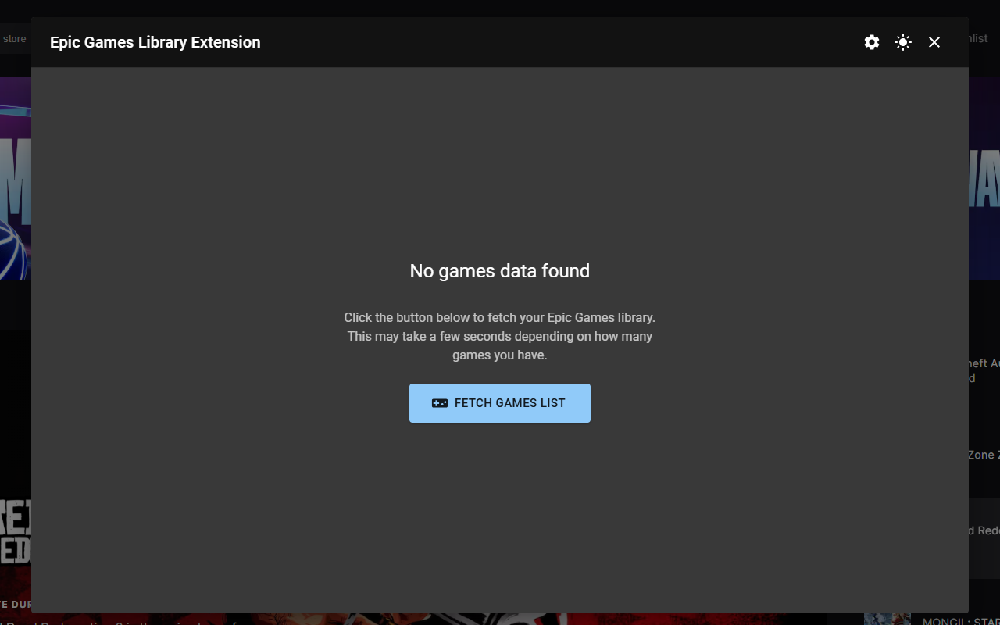

> [!IMPORTANT]
> **Note**: This extension is not officially affiliated with Epic Games.

# Epic Games Library Extension

A browser extension that provides quick access to your Epic Games library with a simple keyboard shortcut.

## Why This Extension?

Currently, the Epic Games Store website doesn't provide a direct way to access your owned games library. The only available workaround is navigating to your account page and then to the transactions section, but this method lacks essential features like filtering, searching, or sorting your games collection. This extension addresses these limitations by providing:

- Direct access to your games library without navigating through multiple pages
- Built-in search functionality to quickly find specific games
- Sorting options to organize your collection
- A clean, user-friendly interface for browsing your games

## Features

- **Quick Access**: Open your Epic Games library with `Alt + G`
- **Smart Search**: Search through your game library by title
- **Sorting Options**: Sort your games alphabetically or by date
- **Dark Mode Interface**: Clean, modern dark theme
- **Seamless Integration**: Works directly on the Epic Games Store website
- **Customizable Shortcuts**: Change the keyboard shortcut to your preference
- **Cross-Browser Support**: Available for Chrome and Firefox

## Screenshots





## Installation

### Chrome Web Store
1. Visit the [Chrome Web Store](https://chromewebstore.google.com/detail/hfhellofkjebbchcdffmicekjdomkcmc?utm_source=item-share-cb)
2. Click "Add to Chrome"
3. Confirm the installation

### Firefox Add-ons
1. Visit [Firefox Add-ons](https://addons.mozilla.org/en-US/firefox/addon/epic-games-library-extension/)
2. Click "Add to Firefox"
3. Confirm the installation

### Manual Installation (Development)
1. Clone this repository
2. Open Chrome/Firefox extension management page
3. Enable "Developer mode"
4. Click "Load unpacked" and select the extension folder

## Usage

1. **Navigate to Epic Games Store**: Go to [store.epicgames.com](https://store.epicgames.com)
2. **Login**: Make sure you're signed in to your Epic Games account
3. **Open Library**: Press `Alt + G` to open your games library dialog
4. **Browse**: Navigate through your games collection quickly

## Customizing Keyboard Shortcuts

### Chrome
1. Open `chrome://extensions/shortcuts` in a new tab
2. Find "Epic Games Library Extension"
3. Click the pencil icon to edit the shortcut
4. Set your preferred key combination

### Firefox
1. Follow [Mozilla's instructions](https://support.mozilla.org/en-US/kb/manage-extension-shortcuts-firefox) to manage extension shortcuts
2. Navigate to the extensions shortcuts settings
3. Modify the shortcut for Epic Games Library Extension

## Development

### Prerequisites
- Node.js and npm
- Modern browser (Chrome/Firefox)

### Setup
```bash
# Clone the repository
git clone <repository-url>
cd epic-games-library

# Install dependencies
npm install

# Build the extension
npm run build

# Start development mode
npm run dev
```

### Technologies Used
- **React**: UI framework
- **TypeScript**: Type-safe JavaScript
- **Material-UI**: Component library
- **WXT**: Extensions framework

## Contact

If you have any questions or suggestions, feel free to contact the project maintainer at [yacine.web.ext@gmail.com](mailto:yacine.web.ext@gmail.com).

## Contributing

Contributions are welcome! If you have any ideas or improvements, please submit a pull request.

## Attribution

The extension icon is created by <a href="https://www.flaticon.com/free-icons/game-boy-advance" title="game boy advance icons">Game boy advance icons created by afif fudin - Flaticon</a>

## License

This project is licensed under the MIT License - see the [LICENSE](LICENSE) file for details.
